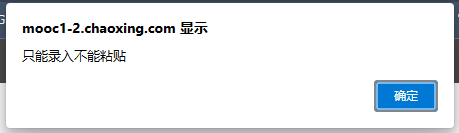
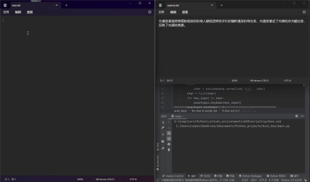

# Auto_Stuendt
This is a repository that can help you turn your PC into a robot student. For example, it includes a script that can automatically perform key and mouse operations on web pages to complete online courses.

## Requirements
```
numpy
opencv-python
pyautogui
```

## Quick start
### Auto_View
1. Place the screenshot of the icons you need to click under the [`templates`](./Auto_View/) folder
2. Modify parameters such as screen resolution, template image path, and wait time in [`params.txt`](./Auto_View/params.txt)
3. Run [`auto_view.py`](./Auto_View/auto_view.txt)

### Auto_Key
1. Copy all text into *'source. txt'* and save it
2. Run *‘auto_key.py’* and then move the mouse to the target text box within 5 seconds
3. Wait for input completion




## More instructions
For more information please visit the blog: http://t.csdn.cn/7pAa9
